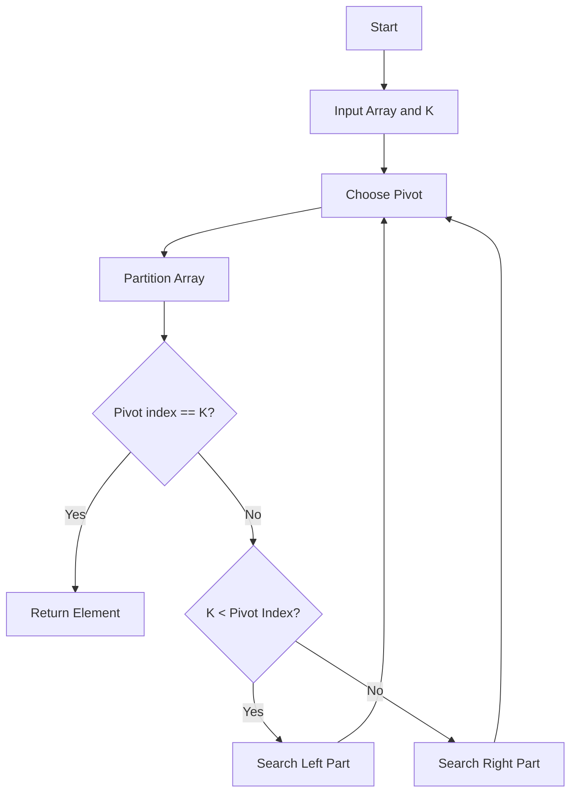
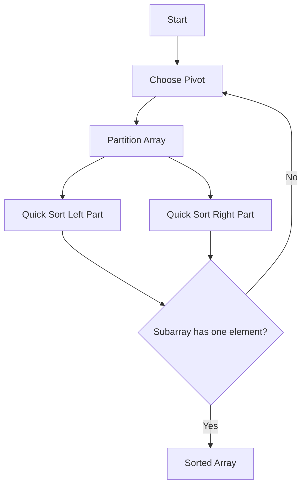
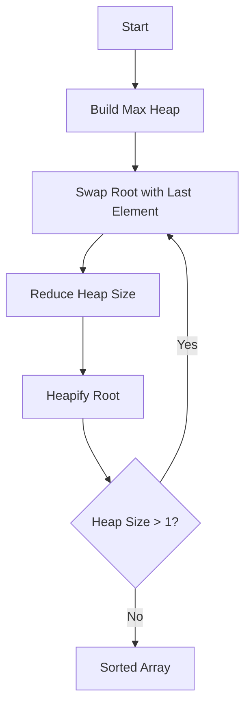
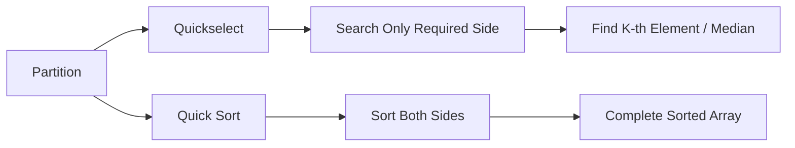
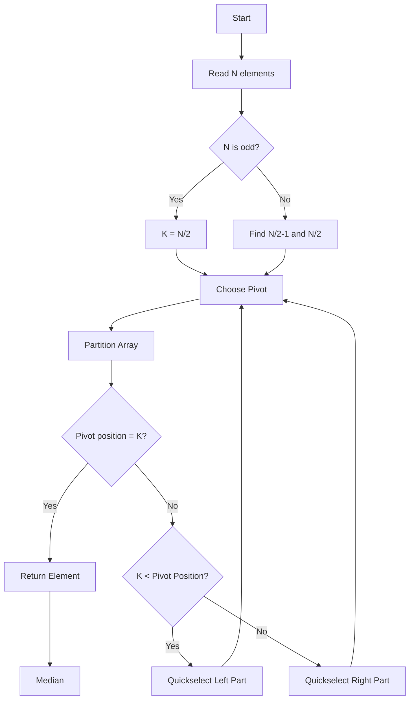
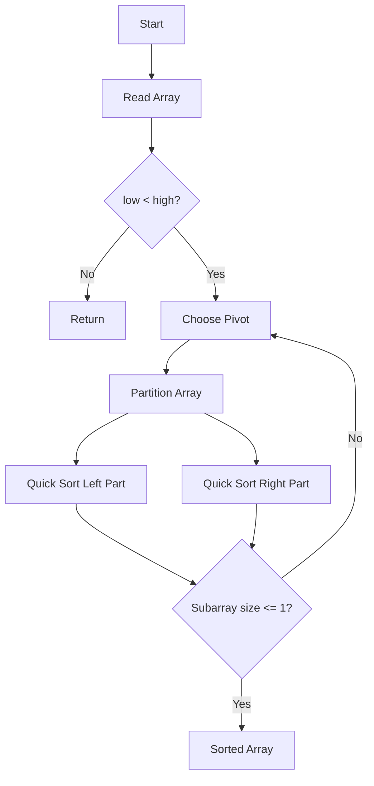
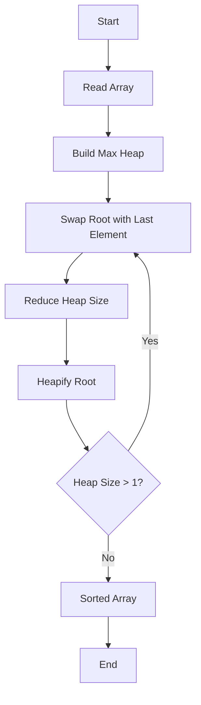
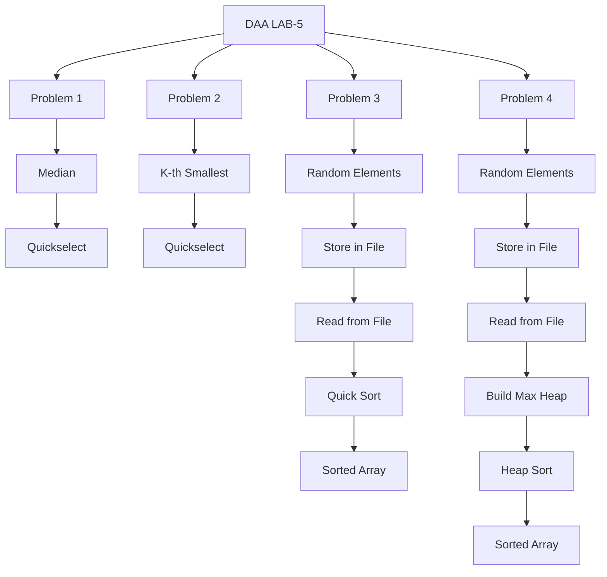

# DAA Lab-5

This repository contains the solutions for **Design and Analysis of Algorithms (DAA) Lab-5**.

## Problems

1. Find the median of N numbers **without sorting the complete list** using Quickselect.
2. Find the K-th smallest element without sorting the complete list using Quickselect.
3. Implement Quick Sort for N randomly generated elements stored in a file.
4. Implement Heap Sort for N randomly generated elements stored in a file.

## Repository Structure

```text
DAA-Lab-5/
├── README.md
├── .gitignore
├── 01_median_quickselect.c
├── 02_kth_smallest_quickselect.c
├── 03_quick_sort_file.c
└── 04_heap_sort_file.c
```

## How to Compile

Using GCC:

```bash
gcc 01_median_quickselect.c -o median
gcc 02_kth_smallest_quickselect.c -o kth_smallest
gcc 03_quick_sort_file.c -o quick_sort
gcc 04_heap_sort_file.c -o heap_sort
```

Run:

```bash
./median
./kth_smallest
./quick_sort
./heap_sort
```

On Windows with MinGW, use:

```bash
median.exe
kth_smallest.exe
quick_sort.exe
heap_sort.exe
```

## Complexity Analysis

| Algorithm | Best | Average | Worst |
|---|---:|---:|---:|
| Quickselect | O(N) | O(N) | O(N²) |
| Quick Sort | O(N log N) | O(N log N) | O(N²) |
| Heap Sort | O(N log N) | O(N log N) | O(N log N) |

### Key Concepts

- **Quickselect:** Uses partitioning and searches only the side containing the required element.
- **Quick Sort:** Uses partitioning and recursively sorts both sides.
- **Heap Sort:** Builds a Max Heap and repeatedly moves the maximum element to the end.
- **Max Heap:** Every parent node is greater than or equal to its children.

## Quickselect Dry Run

For:

```text
Array = [7, 2, 10, 4, 3]
```

Using `3` as pivot:

```text
[7, 2, 10, 4, 3]
          pivot=3

After partition:

[2, 3, 10, 4, 7]
    ^
 pivot index = 1
```

If the required index is `2`, Quickselect searches only the right side:

```text
[10, 4, 7]
```

Partitioning around `7` gives:

```text
[4, 7, 10]
```

Therefore the required element is `7`.

## Heap Sort Dry Run

For:

```text
[4, 10, 3, 5, 1]
```

Build Max Heap:

```text
[10, 5, 3, 4, 1]
```

Move maximum to the end and heapify repeatedly:

```text
[5, 4, 3, 1, 10]
[4, 1, 3, 5, 10]
[3, 1, 4, 5, 10]
[1, 3, 4, 5, 10]
```

Final sorted array:

```text
[1, 3, 4, 5, 10]
```

## Submitted By

**DAA Lab-5 Assignment**

Add your name, roll number, branch, section, and semester before submitting if required by your instructor.


## Graphs / Diagrams

The following diagrams are included for easier understanding and GitHub submission.

### 1. Quickselect Flow



### 2. Quick Sort Flow



### 3. Heap Sort Flow



### 4. Max Heap Structure

For example:

```text
              10
             /  \
            5    3
           / \
          4   1
```

Array representation:

```text
Index:   0   1   2   3   4
Value:  10   5   3   4   1
```

For a node at index `i`:

```text
Left Child  = 2*i + 1
Right Child = 2*i + 2
Parent      = (i - 1) / 2
```

### 5. Quickselect vs Quick Sort



These diagrams are written in **Mermaid**, so GitHub can render them directly inside `README.md`.


# Algorithms and Graphs

## 1. Algorithm: Median Using Quickselect

**Input:** Array `A` of `N` elements.

**Algorithm:**
1. If `N` is odd, set `K = N/2`.
2. If `N` is even, find elements at indices `N/2 - 1` and `N/2`.
3. Choose the last element as the pivot.
4. Partition the array so elements smaller than or equal to the pivot are placed on the left.
5. Get the final position of the pivot.
6. If the pivot position is `K`, return the pivot.
7. If `K` is smaller than the pivot position, repeat Quickselect on the left part.
8. Otherwise, repeat Quickselect on the right part.
9. For an even-sized array, average the two middle elements.

**Pseudocode:**

```text
QUICKSELECT(A, low, high, K)
    if low == high
        return A[low]

    p = PARTITION(A, low, high)

    if p == K
        return A[p]

    if K < p
        return QUICKSELECT(A, low, p-1, K)

    return QUICKSELECT(A, p+1, high, K)
```

### Graph / Flowchart



---

## 2. Algorithm: K-th Smallest Using Quickselect

**Input:** Array `A` of `N` elements and integer `K`.

**Algorithm:**
1. Check that `1 <= K <= N`.
2. Convert K-th position to zero-based index: `K = K - 1`.
3. Choose the last element as pivot.
4. Partition the array.
5. Find the pivot's final position `P`.
6. If `P == K`, the pivot is the answer.
7. If `K < P`, search the left part.
8. If `K > P`, search the right part.
9. Stop when the required element is found.

**Pseudocode:**

```text
QUICKSELECT(A, low, high, K)
    if low == high
        return A[low]

    P = PARTITION(A, low, high)

    if P == K
        return A[P]

    if K < P
        return QUICKSELECT(A, low, P-1, K)

    return QUICKSELECT(A, P+1, high, K)
```

### Graph / Flowchart

```mermaid
flowchart TD
    A[Start] --> B[Read Array and K]
    B --> C[Set K = K-1]
    C --> D[Choose Pivot]
    D --> E[Partition Array]
    E --> F{Pivot Position = K?}
    F -- Yes --> G[Return A[K]]
    F -- No --> H{K < Pivot Position?}
    H -- Yes --> I[Search Left Part]
    H -- No --> J[Search Right Part]
    I --> D
    J --> D
    G --> K[End]
```

---

## 3. Algorithm: Quick Sort

**Input:** Array `A` containing `N` elements.

**Algorithm:**
1. If `low >= high`, stop because the subarray has at most one element.
2. Choose the last element as pivot.
3. Partition the array around the pivot.
4. The pivot reaches its correct position.
5. Recursively apply Quick Sort to the left subarray.
6. Recursively apply Quick Sort to the right subarray.
7. Continue until all subarrays contain at most one element.

**Pseudocode:**

```text
QUICKSORT(A, low, high)
    if low < high
        P = PARTITION(A, low, high)

        QUICKSORT(A, low, P-1)
        QUICKSORT(A, P+1, high)
```

### Graph / Flowchart



### Quick Sort Partition Graph

For:

```text
[7, 2, 10, 4, 3]
```

Pivot = `3`

```text
             3
           /   \
        2       7,10,4
```

After partition:

```text
[2, 3, 10, 4, 7]
```

Then Quick Sort recursively sorts:

```text
Left  = [2]
Right = [10,4,7]
```

---

## 4. Algorithm: Heap Sort

**Input:** Array `A` containing `N` elements.

**Algorithm:**
1. Start with the input array.
2. Build a Max Heap.
3. The largest element is now at the root (`A[0]`).
4. Swap the root with the last element.
5. Reduce the heap size by one.
6. Heapify the root to restore the Max Heap.
7. Repeat steps 3–6 until only one element remains.
8. The array is sorted in ascending order.

**Pseudocode:**

```text
HEAPSORT(A, N)

    for i = N/2 - 1 down to 0
        HEAPIFY(A, N, i)

    for i = N-1 down to 1
        swap(A[0], A[i])
        HEAPIFY(A, i, 0)
```

### Heapify Pseudocode

```text
HEAPIFY(A, N, i)

    largest = i
    left = 2*i + 1
    right = 2*i + 2

    if left < N and A[left] > A[largest]
        largest = left

    if right < N and A[right] > A[largest]
        largest = right

    if largest != i
        swap(A[i], A[largest])
        HEAPIFY(A, N, largest)
```

### Graph / Flowchart



### Max Heap Graph

For:

```text
[10, 5, 3, 4, 1]
```

the tree is:

```text
              10
             /  \
            5    3
           / \
          4   1
```

Array representation:

```text
Index:   0   1   2   3   4
Value:  10   5   3   4   1
```

Relations:

```text
Left Child  = 2*i + 1
Right Child = 2*i + 2
Parent      = (i - 1) / 2
```

---

## 5. Overall Lab-5 Algorithm Graph



## Algorithm Comparison

| Problem | Technique | Main Idea |
|---|---|---|
| Median | Quickselect | Find middle element without complete sorting |
| K-th Smallest | Quickselect | Find required order statistic |
| Quick Sort | Divide and Conquer | Partition and recursively sort both sides |
| Heap Sort | Heap | Build Max Heap and repeatedly extract maximum |

