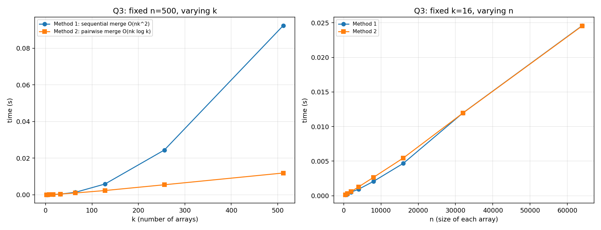

# WEEK 2 – Question 3  
## Merging k Sorted Arrays

---

## Objective

To compare two different methods for merging **k sorted arrays**, each containing **n elements**, and analyze their performance both theoretically and experimentally.

---

## Problem Statement

Given **k sorted arrays**, each of size **n**, merge them into a single sorted array of size **kn** using two different approaches:

### Method 1 (Sequential Merge)
- Merge the first two arrays  
- Merge the result with the third array  
- Continue until all k arrays are merged  

---

### Method 2 (Pairwise Merge)
- Merge arrays in pairs  
- Reduce k arrays to k/2 arrays  
- Repeat until only one array remains  

---

## Theoretical Analysis

### Method 1: Sequential Merge

At each step, the merged array grows:

\[
n + 2n + 3n + \dots + kn
\]

\[
= n(1 + 2 + \dots + k)
= n \cdot \frac{k(k+1)}{2}
\]

\[
\Rightarrow O(nk^2)
\]

---

### Method 2: Pairwise Merge

Each level performs:

- Total work per level = \(O(nk)\)  
- Number of levels = \(\log k\)

\[
\Rightarrow O(nk \log k)
\]

---

## Implementation

The program:

- Generates k sorted arrays
- Applies both methods:
  - Sequential merging
  - Pairwise merging
- Measures execution time
- Outputs results into a CSV file

---

## Graphs

The generated CSV file was imported into **Microsoft Excel** to create the graphs.

Two plots are generated:

### 1. Fixed n = 500, varying k
- Shows how performance changes with number of arrays

### 2. Fixed k = 16, varying n
- Shows how performance changes with array size

---

## Results

### Graphs

---

## Observation

- Method 1 grows **very fast** as k increases  
- Method 2 grows much **more slowly**

- When **k increases**:
  - Method 1 becomes extremely inefficient
  - Method 2 remains scalable

- When **n increases**:
  - Both methods increase linearly with n
  - But Method 2 is consistently faster

---

## Conclusion

- **Method 1 Complexity:**
  \[
  O(nk^2)
  \]

- **Method 2 Complexity:**
  \[
  O(nk \log k)
  \]

- Method 2 is significantly more efficient for large k  
- Pairwise merging is the **preferred approach in practice**

---

## Files

| File | Description |
|------|-------------|
| `merge_k_arrays.c` | Implementation of both methods |
| `merge_k_arrays.csv` | Experimental data |
| `merge_k_arrays.png` | Graph plotted using Excel |
| `README.md` | Documentation |

---

## Note

The comparison is based on **execution time measurements** obtained from simulation. Graphs are generated using Excel for clear visualization.
